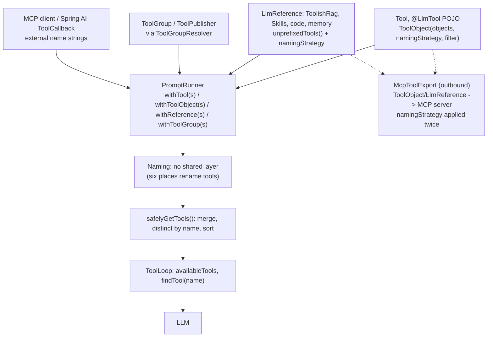

# Proposal: Unified Tool Contribution and Boundary-Only Naming

**Status**: Proposed. Design only; the code in this PR is a stop-gap (see section 8).
**Related**: #1834, #2093, #2095, #2132

## 1. Summary

Tool names sent to the LLM are decided in at least six independent places. Each fix for a
naming bug (`docs_docs_*`, `memory_memory`, `p_p_x`, duplicate registration) adds another
string heuristic where the paths meet. This proposal introduces one owner for the naming
decision (`ToolCatalog`), makes tool sources *declare* how they are namespaced instead of
rewriting strings, and gates the work behind characterization tests that pin today's
LLM-visible names.

## 2. Context: how tools flow today



What each entry point supplies:

| Source | Enters as | Who decides the name |
|---|---|---|
| `Tool` / `@LlmTool` POJO | `ToolObject(objects, namingStrategy, filter)` or `withTool(s)` | a `StringTransformer` attached from outside |
| `LlmReference` (RAG, Skills, memory, code, web) | `unprefixedTools()` + `namingStrategy`; the legacy `tools()` may already be prefixed (`ToolishRag.tools()`) | the reference, via `toolPrefix()` |
| `UnfoldingTool`, `AgenticTool`, `PlaybookTool`, `StateMachineTool` | nested tools; inner tools appear after the parent is called | the parent tool |
| `ToolGroup` / `ToolPublisher` / `ToolConsumer` | resolved by `ToolGroupResolver` | not yet audited (see section 7) |
| MCP client, Spring AI `ToolCallback` | external name strings | the remote server |
| `McpToolExport` (outbound) | `ToolObject` + `namingStrategy`, chained with a second strategy | two transformer layers |
| `PerGoalToolFactory` | generated from goals | the factory |

The function side is already direct: every source ends up as a `Tool` whose `call(input,
context)` runs the code. Identity is the weak part: it is only `definition.name: String`,
and namespacing is a string transformation applied afterwards (`RenamedTool` wraps a tool
only to change its name).

### How an LLM tool call is routed today

There is no name -> tool map. `DefaultToolLoop` keeps `availableTools: MutableList<Tool>`,
sends it with each request, and on a `ToolCall(id, name, args)` does
`tools.find { it.definition.name == name }` (`StreamingToolLoop` does the same). On a miss,
`ToolNotFoundPolicy` (default `AutoCorrectionPolicy`, Jaccard similarity over name tokens)
feeds a hint back to the model. `UnfoldingTool` has its own `associateBy` for shortcut
dispatch of inner tools. Consequences: the list can change between iterations (injected or
removed tools), and if two tools share a name `find` silently picks the first. Dedup happens
earlier and only by raw string (`distinctBy`).

## 3. Problem

1. **No owner for the final name.** Names are rewritten in `LlmReference`
   (`toolPrefix`/`namingStrategy`), `ToolObject.withPrefix`, `McpToolExport`,
   `ToolishRag.tools()`, `RenamedTool`, and `Skills.sanitizeToolName` (a second, independent
   copy of the sanitization rule).
2. **Two meanings for one method.** `tools()` may return prefixed names (backward
   compatibility) while `unprefixedTools()` returns bare names. The aggregator cannot tell
   which it received, so it guesses (`startsWith("${prefix}_")`).
3. **Intent is not declared.** A reference whose single tool *is* the entry point (`memory`)
   and a reference whose tools are members (`docs` + `search`) look the same to the
   aggregator.
4. **Names are rendered in several places** (LLM catalog, prompt text such as the script
   tool list in `Skills`, MCP export, logs) with no shared source of truth.
5. **No end-to-end check.** Tests cover single leaves; nothing pins the final names across
   all sources, so a naming change in one place is invisible in another.

### Why it grew this way (inferred from code and history)

Each source arrived later and reused the only mechanism available (`StringTransformer`).
Backward compatibility kept old methods alive (`toolInstances` -> `tools` ->
`unprefixedTools`). Fixes were applied at the symptom (#2093, #2132, this PR), and duplicate
name cases from #1834 were recorded as disabled tests rather than resolved. Strings are the
easiest type to extend, so nothing forced a source to state its intent.

## 4. Principle

Sources **declare** how their tools are namespaced. One component **decides** the wire name,
checks collisions, and serves lookups. Strings exist only at two boundaries: inbound (MCP,
Spring AI, annotations) and the LLM wire.

## 5. Design

```kotlin
// domain
sealed interface Namespacing {
    data object None : Namespacing                    // names are already final
    data class Prefix(val ns: String) : Namespacing   // docs + search -> docs_search
    data class Collapse(val ns: String) : Namespacing // the tool is the entry point: memory -> memory
    // Deprecated bridge for user-written strategies; removed after the deprecation period.
    data class Custom(val transform: StringTransformer) : Namespacing
}

// port, implemented by every source
interface ToolSource {
    fun contribute(): ToolContribution
}

data class ToolContribution(
    val namespacing: Namespacing,
    val tools: List<Tool>,            // simple names, not prefixed
    val children: List<ToolContribution> = emptyList(), // nested tools (unfolding)
    val promptNotes: String? = null,
)
```

`ToolCatalog` (application layer) is the single aggregation point:

- accepts contributions and resolves every wire name in one place; `ToolObject.filter` keeps
  seeing the simple name, applied before namespacing, as today;
- detects collisions on the resolved wire name and applies one policy (fail, or warn once
  per distinct pair), unwrapping delegating wrappers so messages name the real tools;
- exposes `byWireName: Map<String, Tool>` for routing and `nameFor(tool)` for prompt text;
- supports dynamic additions (tool-loop injection/removal) without rebuilding names by hand.

| Layer | Holds |
|---|---|
| Domain | `Tool`, `Namespacing` (later possibly `ToolId`) |
| Application | `ToolCatalog`: aggregation, namespacing decision, collision policy |
| Port | `ToolSource` (`ToolPublisher` is a close existing precedent) |
| Adapters | RAG, Skills, MCP, Spring AI, `UnfoldingReference` implement `ToolSource` |
| Wire boundary | sanitization, allowed characters, per-provider length limits |

`LlmReference` stops carrying sanitization in a default method. A plain reference maps to
`Prefix`, `UnfoldingReference` to `Collapse`, final-name sources to `None`. This replaces the
idempotent guard in `namingStrategy` with explicit intent.

## 6. What this does and does not fix

- `memory_memory`, `docs_docs`: sources say `Collapse`/`None`; nothing is guessed.
- Duplicate registration and wrapper-identity false positives: dedup uses the resolved name.
- Prompt/catalog drift: both call `nameFor`.
- Not fixed by types alone: a tool named `docs_search` inside a `Prefix("docs")` source still
  becomes `docs_docs_search`; sources must supply simple names.
- Joining with `_` is not injective (`(a_b, c)` and `(a, b_c)` both give `a_b_c`), so the
  collision check on wire names is required.

### Boundary rules

- Inbound names (MCP, Spring AI, `@LlmTool`) are parsed into a contribution once; outbound
  names are produced once by the catalog.
- The LLM returns a wire-name string. Routing uses `byWireName`; the formatter is not
  invertible once names are lowercased or sanitized, so never parse a wire name back.
- Display names are normalized through a factory (`"My API"` -> `my_api`); `require` guards
  only already-normalized values. Allowed characters and maximum length are provider
  configuration (OpenAI: `^[a-zA-Z0-9_-]{1,64}$`; MCP names may contain `.`), not core
  constants.
- Non-ASCII reference names collapse to underscores; two references can then share a prefix.
  The collision check must report it.

## 7. Risks and open items

- Public API surface: `ToolObject.namingStrategy`, `LlmReference.tools()` /
  `unprefixedTools()`, `McpToolExport`, Java callers. Needs adapters and a deprecation path.
- LLM-visible names are a de facto contract (prompts, tests, integrations depend on them), so
  no step may change them unnoticed.
- The `ToolGroup` / `ToolGroupResolver` branch has not been audited for naming rules; it must
  be covered by the characterization tests before the catalog is wired in.
- Dynamic tools (unfolding, loop injection) require the catalog to support nested and
  incremental contributions.

## 8. Roadmap

0. **This PR (stop-gap)**: single-path registration, idempotent guard, whitespace-safe
   `toolPrefix()`, inner-tool renaming for unfolding, collision warning. Known gaps are listed
   in the PR description. These heuristics are meant to be removed by step 2.
1. **Characterization tests (gate for everything below).** Integration tests per leaf that
   pin final wire names, plus a golden file of `source -> wire names` where any diff must be
   reviewed. Pin current behavior, marking known quirks as such. Per leaf, at least:
   - plain name; name equal to the prefix; name starting with `prefix_`; mixed case;
   - reference names with spaces, punctuation, non-ASCII, empty/blank;
   - two sources producing the same wire name (collision policy);
   - `ToolObject.filter` combined with naming;
   - unfolding: outer and inner names, shortcut dispatch;
   - MCP export with chained naming strategies;
   - dynamic tools injected or removed by the tool loop;
   - round trip: the wire name the LLM would return reaches the right function;
   - names rendered in prompt text equal the names in the catalog.
   Leaves: `Tool`/`@LlmTool` via `ToolObject`, `ToolishRag`, `Skills` (+ script tools), memory,
   code/file references, `UnfoldingReference`, agentic tools, MCP export, MCP client /
   Spring AI callbacks, `ToolGroup`, `PerGoalToolFactory`.
2. Add `Namespacing`, `ToolContribution`, `ToolCatalog` internally, used by
   `PromptRunner.withReference` and `safelyGetTools`. `Tool` and `LlmReference` unchanged; an
   adapter converts `LlmReference` and `ToolObject`. Done when the `startsWith` guard is
   deleted and the step-1 tests pass untouched.
3. Move leaves to declarations one PR at a time (`Skills`, `ToolishRag`, `McpToolExport`
   first); delete `Skills.sanitizeToolName`. `byWireName` replaces the linear `find` in
   `DefaultToolLoop` / `StreamingToolLoop`.
4. Optional: introduce `ToolId`; deprecate `StringTransformer`, `RenamedTool`,
   `Namespacing.Custom` and the `tools()` / `unprefixedTools()` split.

Open question for maintainers: is a catalog-level refactor (step 2) acceptable before any
change to the `Tool` interface?
