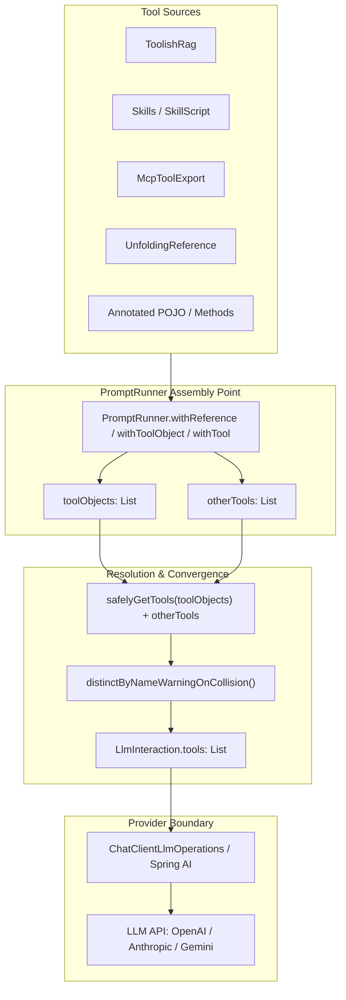

# Architectural Proposal: Type-Driven Tool Identity & Boundary-Only Stringification

**Author**: Tuan Nguyen & DeepMind Pair Programming Assistant  
**Date**: October 2026  
**Status**: Proposed (Phase 1 Implemented in PR)  
**Related Issues / PRs**: #2093, #2095, #2132  

---

## 1. Executive Summary & Root Cause Analysis

Recent bugs and regression debates around tool registration in `PromptRunner`, `LlmReference`, `ToolishRag`, and `Skills` (#2093, #2095, #2132) revealed a fundamental vulnerability in the system's architecture: **String-Oriented Programming (Primitive Obsession) in Tool Identity**.

### The Core Issues
1. **Multi-Path Registration Bug (#2132)**:
   `PromptRunner.withReference()` previously registered tools twice:
   - Once via `withToolObject(reference.toolObject())` (applying `reference.namingStrategy`).
   - Once via `withTools(reference.tools())` (passing raw or pre-prefixed names).
   This resulted in duplicate tools sent to the LLM, breaking schema validation and confusing model function-calling loops.
2. **Double-Prefixing & Fragile String Concatenation**:
   When references and nested tool containers (such as `ToolishRag`, `Skills`, `UnfoldingTool`, and DICE `Memory`) expose tools, they mutate tool names via string transformations:
   $$\text{newName} = \text{prefix} + \text{"\_"} + \text{oldName}$$
   This caused:
   - `docs_vectorSearch` becoming `docs_docs_vectorSearch`.
   - `memory` becoming `memory_memory`.
   - `github_workflows` becoming `github_workflows_github_workflows`.
   - Script tools becoming `p_p_x`.
3. **Loss of Tool Provenance & Identity**:
   Wrapping a tool in `RenamedTool` stripped or masked context, and de-duplication was performed using naive string equality (`distinctBy { it.definition.name }`), causing silent drops when names clashed.

---

## 2. Anatomy of the Current Aggregation Pipeline

Where do tools congregate today before being dispatched to the LLM?



### The Current Information Flow:
1. **Tool Objects**: `ToolObject(objects: List<Any>, namingStrategy: StringTransformer, filter: (String) -> Boolean)`.
2. **Tool Definition**: `Tool.Definition(name: String, description: String, inputSchema: Tool.InputSchema)`.
3. **Execution Function**: `Tool.call(input: String, context: ToolCallContext): Tool.Result`.

### Why This Is Fragile:
- **`StringTransformer` is blind**: It does not know who owns the tool, whether the name was already prefixed, or what namespace hierarchy exists.
- **De-duplication is lossy**: When two tools produce the same string, one is dropped without structural insight into whether they are the same tool or conflicting implementations.

---

## 3. The Target Architecture: Type-Driven Tool Identity

Instead of passing mutable strings and relying on string transformers, tool management should transition to **Type-Driven Identity** with **Boundary-Only Stringification**.

### 3.1 Structural Identity: `ToolId` & `ToolNamespace`

```kotlin
package com.embabel.agent.api.tool

/**
 * Hierarchical namespace representing ownership/source of a tool.
 * Examples: ToolNamespace("docs"), ToolNamespace("skills", "github-workflows")
 */
@JvmInline
value class ToolNamespace(val segments: List<String>) {
    constructor(vararg segments: String) : this(segments.filter { it.isNotBlank() })

    val isRoot: Boolean get() = segments.isEmpty()

    fun child(segment: String): ToolNamespace =
        ToolNamespace(segments + segment)

    companion object {
        val ROOT = ToolNamespace(emptyList())
    }
}

/**
 * Immutable, globally unique structural identifier for a tool.
 */
data class ToolId(
    val namespace: ToolNamespace = ToolNamespace.ROOT,
    val name: String,
) {
    init {
        require(name.isNotBlank()) { "Tool simple name cannot be blank" }
    }

    fun within(parentNamespace: ToolNamespace): ToolId =
        ToolId(ToolNamespace(parentNamespace.segments + namespace.segments), name)
}
```

### 3.2 First-Class Tool Descriptor & Direct Function Binding

Directly couple identity and the execution function pointer without intermediary string wrapping:

```kotlin
interface ToolDescriptor {
    val id: ToolId
    val description: String
    val schema: Tool.InputSchema
    val metadata: Tool.Metadata
    
    /**
     * Direct function execution binding.
     */
    fun execute(input: String, context: ToolCallContext): Tool.Result
}
```

### 3.3 The `ToolRegistry` Primitive

Replace loose lists (`toolObjects` and `otherTools`) with a strongly typed registry:

```kotlin
class ToolRegistry private constructor(
    private val entries: Map<ToolId, ToolDescriptor> = emptyMap()
) {
    fun register(descriptor: ToolDescriptor): ToolRegistry {
        val existing = entries[descriptor.id]
        if (existing != null && existing !== descriptor) {
            logger.warn("Duplicate tool registration for ID ${descriptor.id}. Overriding.")
        }
        return ToolRegistry(entries + (descriptor.id to descriptor))
    }

    fun registerAll(descriptors: Collection<ToolDescriptor>): ToolRegistry =
        descriptors.fold(this) { acc, desc -> acc.register(desc) }

    fun get(id: ToolId): ToolDescriptor? = entries[id]

    fun all(): Collection<ToolDescriptor> = entries.values
}
```

---

## 4. Boundary-Only Stringification (Late Wire Serialization)

### Should we strictly avoid `String` before calling the LLM?
- **Internally: YES, absolutely.**
  Throughout the SDK, RAG engines, Skill engines, and PromptRunner, tools MUST be identified, indexed, and routed solely by `ToolId` and function pointers.
- **At the LLM Network Wire: NO (by protocol constraint).**
  External LLM APIs (OpenAI Function Calling, Anthropic Tool Use, Gemini Function Declarations) mandate a single string identifier (matching regex like `^[a-zA-Z0-9_-]{1,64}$`).
- **The Solution: Pure Wire-Boundary Serialization.**
  String formatting happens **at the edge adapter only**, right before JSON serialization:

```kotlin
interface WireToolNameFormatter {
    fun format(id: ToolId): String
    fun parse(wireName: String): ToolId?
}

object StandardWireToolNameFormatter : WireToolNameFormatter {
    override fun format(id: ToolId): String {
        if (id.namespace.isRoot) return sanitize(id.name)
        val ns = id.namespace.segments.joinToString("_") { sanitize(it) }
        return "${ns}_${sanitize(id.name)}"
    }

    private fun sanitize(value: String): String =
        value.trim().lowercase().replace(Regex("[^a-zA-Z0-9]"), "_").trim('_')
}
```

### Bidirectional Wire Routing:
When the LLM responds with a tool call:
1. Provider adapter extracts wire name: `"docs_vectorSearch"`.
2. Registry looks up mapped `ToolId(ToolNamespace("docs"), "vectorSearch")`.
3. Invokes `descriptor.execute(input, context)` directly.
4. No ambiguity, zero string mutation in transit!

---

## 5. Phased Roadmap

### Phase 1 (Immediate / Implemented in this PR):
- Enforce single-path registration in `PromptRunner.withReference()`.
- Add idempotent guard to `LlmReference.namingStrategy` (prevents `memory_memory`, `p_p_x`).
- Sanitize whitespace in `LlmReference.toolPrefix()` (`"My API"` $\rightarrow$ `"my_api"`).
- Propagate naming strategy to inner tools of `UnfoldingReference` to avoid cross-reference collisions.
- Add collision diagnostic warning logging in `safelyGetTools`.
- Add full test assertions protecting `runner.otherTools.isEmpty()`.

### Phase 2 (Intermediate Bridge):
- Introduce `ToolId` and `ToolDescriptor` as optional extensions in `embabel-agent-api`.
- Bridge `ToolObject` to populate `ToolRegistry` internally.
- Deprecate `StringTransformer.transform` on tool names in favor of structured namespacing.

### Phase 3 (Unified Architecture):
- Migrate `LlmInteraction` to consume `ToolRegistry`.
- Wire `ChatClientLlmOperations` directly to `WireToolNameFormatter`.
- Eliminate `RenamedTool` wrapper and string-based distinct operations completely.
