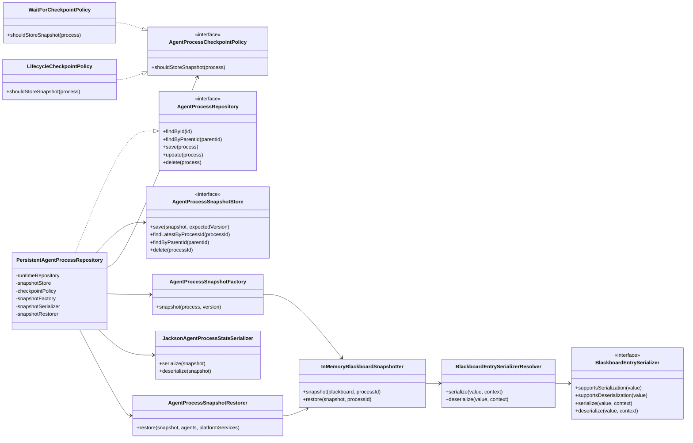

# Agent Process Persistence Support

This package contains framework support for checkpointing and restoring agent
processes. It is deliberately backend-neutral: durable storage is supplied
through `AgentProcessSnapshotStore`, while this package owns snapshot creation,
serialization, restoration, and decoration of an `InMemoryAgentProcessRepository`
or another runtime `AgentProcessRepository`.

The first supported lifecycle boundaries are:

- `WAITING`: used as a recovery checkpoint for HITL flows parked by `waitFor`.
- Finished states: used to advance durable state after resumed work completes,
  fails, is killed, or is terminated.

JDBC, cache, Redis, or other storage implementations are not shipped from this
package. They should implement `AgentProcessSnapshotStore` outside the framework
or appear as test fixtures.

## Extension Points

- Implement `AgentProcessSnapshotStore` for the application's durable backend.
- Implement `BlackboardEntrySerializer` for application values that should be
  stored as references, encrypted payloads, or stable DTOs instead of generic
  JSON object graphs.
- Choose `WaitForCheckpointPolicy` for recovery-only checkpoints or
  `LifecycleCheckpointPolicy` when the durable row should also reflect terminal
  process state.

`PersistentAgentProcessRepository` delegates first to an
`InMemoryAgentProcessRepository` in the current tests. More generally, that
delegate is the runtime repository holding active in-process objects; the
snapshot store is only consulted when the runtime repository misses.

## TODO

### Cache integration

- **Spring Boot autoconfiguration**: when an `AgentCacheProvider` bean is
  present, automatically create a `CacheBackedAgentProcessSnapshotStore` using
  `CacheRegions.AGENT_PROCESS_SNAPSHOTS` and register it as the
  `AgentProcessSnapshotStore` bean. Users should need no manual wiring beyond
  declaring their cache backend.
- **Boot-context E2E test**: prove that a `CacheManager` or `AgentCacheProvider`
  bean alone activates platform persistence — snapshot saved, pod-loss simulated,
  process restored on a fresh repository.
- **Distributed CAS E2E with Testcontainers Redis**: `SpringCacheAgentCacheProvider`
  uses in-JVM locking only and cannot guarantee `ATOMIC_COMPARE_AND_SET` across
  pods. A Testcontainers-backed Redis test is needed to prove concurrent
  checkpoint conflicts are correctly rejected in a real distributed scenario.
- **Native Redis provider** (`embabel-agent-cache-redis`): implement
  `AgentCacheProvider` over Lettuce or Redisson with atomic `SET ... IF` for
  production-safe `ATOMIC_COMPARE_AND_SET`.
- **Parent index cleanup in `CacheBackedAgentProcessSnapshotStore`**: `save()`
  adds the new parent index entry but does not remove the old one if `parentId`
  changes. Confirm `parentId` is immutable and assert it, or add cleanup on
  update.
- **Callback wiring for restored `ConcurrentAgentProcess`**: production
  autoconfiguration must supply the same `AgentProcessCallback` providers used
  by newly created processes.

### Action-boundary checkpoint

- **`PostActionCheckpointPolicy`**: checkpoint after each action completes so a
  long-running agent can resume from its last completed action rather than
  restart entirely on pod loss. This is the main gap for non-HITL agents that
  are too expensive to restart.
- **Factory support for `RUNNING` state**: `AgentProcessSnapshotFactory`
  currently requires `WAITING` or finished. Supporting action-boundary snapshots
  requires snapshots of a `RUNNING` process with partial action history.
- **Planner resume from partial history**: on restore from an action-boundary
  snapshot, the planner must skip already-completed actions and continue from
  where execution left off.
- **Pre-LLM call checkpoint** *(follow-on)*: checkpoint before expensive
  non-deterministic LLM calls so a pod failure after the call does not force a
  re-run. Requires wiring into the operation scheduler or LLM client layer.
- **Explicit/programmatic checkpoint** *(follow-on)*: allow agent or action code
  to call `checkpoint()` at semantically meaningful points, giving developers
  control without the cost of checkpointing every action boundary.

### Other

- **`BlackboardSnapshotter` SPI**: replace the direct `InMemoryBlackboard` cast
  in `AgentProcessSnapshotFactory` so persistence is not tied to one blackboard
  implementation.
- **Versioning ergonomics**: the persistent repository computes expected
  versions internally; direct `AgentProcessSnapshotStore` callers must still
  supply the correct compare-and-set version manually.
- **Retry / outbox semantics**: define behavior for rejected checkpoints in
  multi-runtime deployments — fail fast, retry with back-off, or outbox pattern.
- **`InMemoryBlackboard.bind` overwrite behavior**: repeated bind calls for the
  same key append old values as unnamed entries. Decide whether to preserve or
  replace; snapshot restore preserves current behavior.

### Blackboard audit events

- **`BlackboardListener` SPI on `Blackboard`**: fire before/after each `bind()`
  and remove, supplying old value and new value. Without this hook, audit can
  only diff consecutive snapshots and misses intra-action intermediate changes.
- **`BlackboardAuditEvent`**: `processId`, `actionName`, `key`,
  `changeType` (ADDED / UPDATED / REMOVED), `oldValue: SerializedBlackboardValue?`,
  `newValue: SerializedBlackboardValue?`, `timestamp`. Reuses
  `SerializedBlackboardValue` and `BlackboardEntrySerializer` for both sides.
- **`BlackboardAuditPublisher` SPI**: append-only backend decoupled from
  `AgentProcessSnapshotStore`. Audit events are immutable; snapshots are
  mutable overwrites — they must not share the same store.
- **Action context threading**: the blackboard mutation point sits inside an
  action executor. The listener needs the current action name threaded through
  so each audit event records its cause.
- **`BlackboardEntrySerializationContext` extension**: add `actionName` and
  `changeType` fields so serializers can include audit metadata in the payload
  without breaking the existing snapshot serialization path.

## Nice to Have

- **JDBC `AgentProcessRepository`**: for cases where runtime state and snapshots
  must participate in the same database transaction. The current
  `InMemoryAgentProcessRepository` is sufficient for Kubernetes HITL recovery
  via snapshot restore-on-miss.

## Scope

Most classes in this package are `internal` because they are support
implementation rather than public API. Public customization is intentionally
limited to the storage SPI, checkpoint policy, and blackboard entry serializers.
