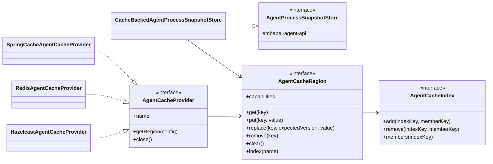

# Embabel Agent Cache

Pluggable third-party cache and key-value backends for agent state.

A backend is integrated **once**, through `AgentCacheProvider`, and then serves
every consumer that needs durable or shared state — process snapshots today,
contexts and shared runtime process state next. Without this, each consumer
would grow its own Redis integration, with its own connection management, key
naming, TTL handling and health checks.

This module depends on `embabel-agent-api`, never the reverse. The API module
declares the consumer interfaces (`AgentProcessSnapshotStore`,
`ContextRepository`); this module adapts them onto a cache. `embabel-agent-api`
gains no new dependencies and needs no changes.

## Layering

## Regions

Regions exist because the data has genuinely different retention needs.

| Region | Holds | Policy |
|---|---|---|
| `agent-process-snapshots` | durable HITL checkpoints | compare-and-set required; no TTL |
| `agent-contexts` | long-lived cross-process state | TTL |
| `agent-processes-runtime` | runtime process state shared between nodes | short TTL |

## Capabilities, not lowest common denominator

Backends differ in what they can guarantee, and the SPI says so out loud rather
than pretending otherwise. A region declares its `capabilities`; a consumer that
cannot function without one asks for it via
`CacheRegionConfig.requiredCapabilities`, and a provider that cannot meet the
request throws `CacheCapabilityException` at setup.

This follows Hibernate's handling of `AccessType.TRANSACTIONAL`, which throws
rather than silently degrading. A lost checkpoint under concurrent HITL resume
is exactly the failure this design refuses to hide.

| Capability | `spring-cache` | `redis` | `hazelcast` |
|---|---|---|---|
| `ATOMIC_COMPARE_AND_SET` | no — read-modify-write | yes — Lua / `SET ... IF` | yes — `IMap.replace(k, old, new)` |
| `SECONDARY_INDEX` | emulated via companion entries | yes — Redis sets | yes — `IMap` predicates |
| `TIME_TO_LIVE` | backend config only | yes | yes |

## Writing a provider

Implement `AgentCacheProvider` and `AgentCacheRegion`. Everything else —
snapshot headers, versioning, index maintenance, restore — is in
`com.embabel.agent.cache.support` and is written once.

`SpringCacheAgentCacheProvider` is the reference implementation and the shortest
path for most backends: any Spring `CacheManager` works with no new code, at the
cost of the guarantees noted above.

## Modules

- `embabel-agent-cache-core` — SPI and backend-neutral support
- `embabel-agent-cache-redis` — native Redis provider *(planned)*
- `embabel-agent-cache-hazelcast` — native Hazelcast provider *(planned)*
